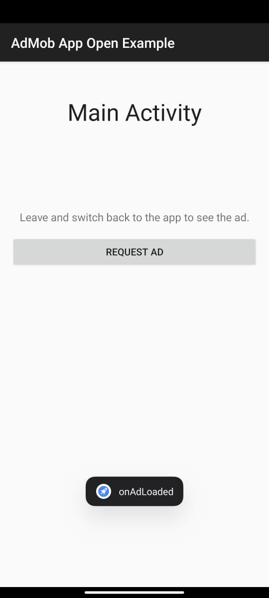
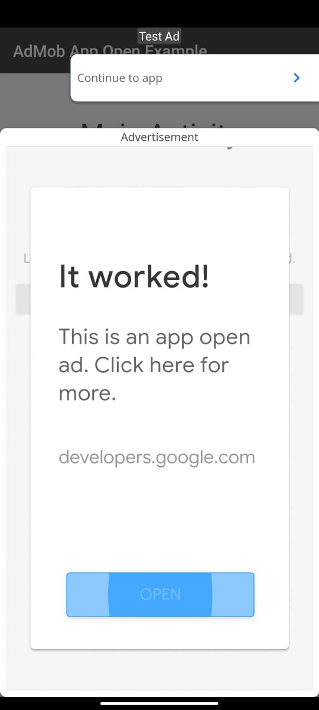

## Admob App Open Ad
[](https://github.com/amirisback/android-admob-app-open-ad/actions/workflows/android-ci.yml)

- Simple Implementation
- Easy to use
- Using Preference For Save Data Add Unit Id

## Version Release
```md
$version_release = 1.0.0
```

## What's Next
- Create this project become library inside [frogo-admob](https://github.com/amirisback/frogo-admob)

## Screen Shot
<table>

<tr>
    <th>SS 1</th>
    <th>SS 2</th>
</tr>

<tr>
    <td></td>
    <td></td>
</tr>

</table>

## Colaborator
Very open to anyone, I'll write your name under this, please contribute by sending an email to me

- Mail To faisalamircs@gmail.com
- Subject : Github _ [Github-Username-Account] _ [Language] _ [Repository-Name]
- Example : Github_amirisback_kotlin_admob-helper-implementation

Name Of Contribute
- Muhammad Faisal Amir
- Waiting List
- Waiting List

Waiting for your contribute

## Attention !!!
- Please enjoy and don't forget fork and give a star
- Don't Forget Follow My Github Account
